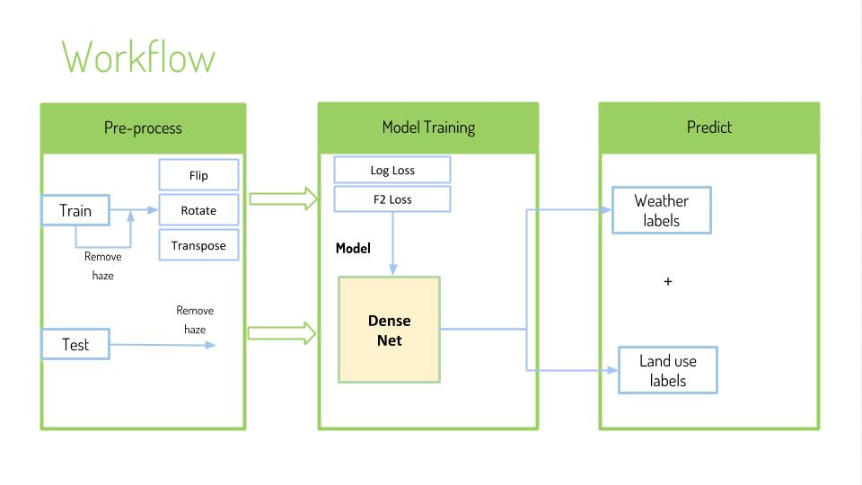

# Requirements

Python >= 3.4, Keras 2.1.6, Tensorflow

[Dataset](https://www.kaggle.com/c/planet-understanding-the-amazon-from-space/data)

# Contents

- working process
  - EDA.ipynb  (Image labels Analysis, display images before and after haze removed)
  - Planet.ipynb 
- Functions
  - a00_remove_haze.py  
    -  Created new folder and store all the haze-free images
  - a10_densenet_121.py
    -  Build a DenseNet model
  - a02_custom_metrics.py
    - Define metrics such as precison, recall and F2 score
- Output model
  - model 1 . b01_dense121.h5 (DenseNet 121)

# How to run

Predict.ipynb

(Predict labels of unlabelled test images)

# Dataflow

